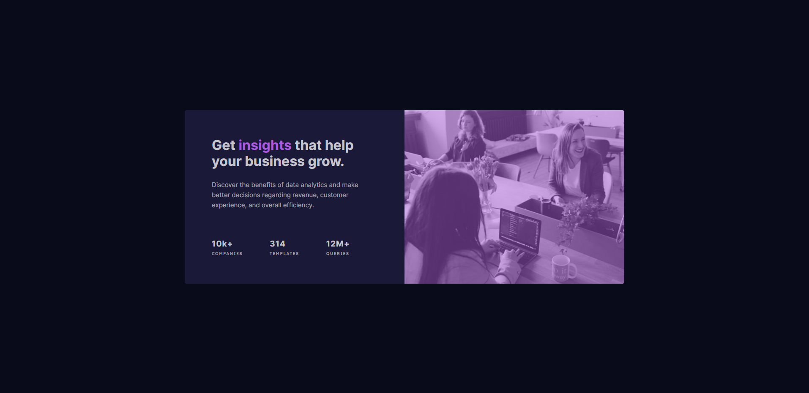

# Frontend Mentor - Stats preview card component solution

This is a solution to the [Stats preview card component challenge on Frontend Mentor](https://www.frontendmentor.io/challenges/stats-preview-card-component-8JqbgoU62).

## Table of contents

- [Overview](#overview)
  - [Challenge](#challenge)
  - [Screenshot](#screenshot)
  - [Links](#links)
- [My process](#my-process)
  - [Built with](#built-with)
  - [What I learned](#what-i-learned)
  - [Continued development](#continued-development)
  - [Useful resources](#useful-resources)
- [Author](#author)

## Overview

### Challenge

Users should be able to:

- View the optimal layout depending on their device's screen size.

### Screenshot

### Links

- Solution URL: [See the code on GitHub](https://github.com/KristinaRadosavljevic/stats-preview-card-component)
- Live Site URL: [View live site](https://stats-preview-card-component-jade.vercel.app/)

## My process

### Built with

- Semantic HTML5 markup
- CSS/Sass
- Flexbox
- CSS grid

### What I learned

In this simple challenge, I got to get some more practice with using grid and flexbox to create responsive layouts. I also learned about accessibility and tinted overlay for background images.

### Continued development

In the future, I would like to take on some more complex projects to really practice various grid layouts.

### Useful resources

For this challenge, I found a couple of resources particulary useful:

- [Article on dev.to](https://dev.to/chrissiemhrk/how-to-setup-sass-in-your-project-2bo1): This proved to be a very useful and clean checklist for setting up Sass that I've already used in a couple of projects.
- [MDN web docs](https://developer.mozilla.org/en-US/docs/Web/Accessibility/ARIA/Roles/img_role): This was my main resource to learn about making an empty `
` with a background accessible.
- [CSS-Tricks](https://css-tricks.com/tinted-images-multiple-backgrounds/): This article helped me figure out the easiest way to get the tinted background image.

## Author

- LinkedIn - [Kristina Radosavljevic](https://www.linkedin.com/in/radosavljevic-kristina/)
- GitHub - [KristinaRadosavljevic](https://github.com/KristinaRadosavljevic)
- Frontend Mentor - [@KristinaRadosavljevic](https://www.frontendmentor.io/profile/KristinaRadosavljevic)
